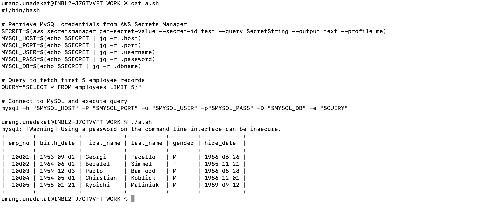

# Task

This task involves provisioning an EC2 server, installing an SQL server on it, and setting up a script to execute queries on the database.

## Directory Structure

This repository contains infrastructure and scripts for managing MySQL databases using Terraform and shell scripts.

```
│── .github/workflows/
│ │── run_mysql_query.yml
│── query-script/ 
│ ├── query_mysql.sh # Script to run MySQL queries 
│── terraform/ 
│ ├── install_mysql.sh # Shell script to install MySQL 
│ ├── main.tf # Terraform main configuration 
│ ├── providers.tf # Terraform provider configuration 
│ ├── terraform.tfvars # Terraform variables 
│ ├── variables.tf # Terraform variables definition
```

## Step-1: Spin up a Micro Instance in a choice of your cloud provider.

✅ The EC2 instance is provisioned using Infrastructure as Code (IaC) with Terraform. The required configuration files are stored in the terraform directory.

```
terraform/
│── main.tf                     # Defines EC2 instance and resources
│── providers.tf                 # Configures the cloud provider
│── variables.tf                 # Stores configurable parameters
│── terraform.tfvars             # Variable values for customization
│── install_mysql.sh             # User data script for MySQL setup
```

✅ The EC2 instance is created using Terraform. A user-data script (install_mysql.sh) is executed automatically on the instance. This script installs MySQL, updates the configuration, and ensures the service is running.

## Step-2: Enable SSH access restricted to your current Public IP Address.

✅ To secure the server, SSH access is restricted to your current public IP.

✅ The Terraform script configures a security group that only allows SSH access from your IP.


✅ Ensure your IP is correctly set in main.tf before applying Terraform.

✅ For accessing it add belo config under ssh config to access you instance from your local machine

```
Host test-ec2
    HostName <IP>
    User ubuntu
    IdentityFile ~/.ssh/<key-name>.pem
    IdentitiesOnly yes
```

## Step-3: Install MySQL on the EC2 instance.

✅We have two ways to install MySQL on the instance:

    1. Manual Setup After Launch:

    2. SSH into the instance and manually install MySQL.

✅ Configure MySQL settings as required.

    1. Automated Setup via User Data:

    2. A script (install_mysql.sh) is included in the Terraform user data to automate MySQL installation and configuration.

✅ This script ensures that MySQL is ready to use immediately after the instance is provisioned.

## Step-4: Change the port of MySQL to 3307.

✅ Initially, MySQL runs on the default port 3306. To enhance security and avoid conflicts, we change the port to 3307. This configuration is automated through the user data script.

    ```
    sudo sed -i 's/^#\s*port\s*=.*/port = 3307/' /etc/mysql/mysql.conf.d/mysqld.cnf

    sudo sed -i 's/^bind-address\s*=.*/bind-address = 0.0.0.0/' /etc/mysql/mysql.conf.d/mysqld.cnf

    sudo systemctl restart mysql
    ```

## Step-5: Create a new admin account in MySQL.

✅ A new admin user is created in MySQL as part of the user data script. Initially, this was set up manually, but it has been automated for consistency and efficiency.

    ```
    sudo mysql -e "CREATE USER '<User>'@'%' IDENTIFIED BY '<Password>';"

    sudo mysql -e "GRANT ALL PRIVILEGES ON *.* TO '<User>'@'%' WITH GRANT OPTION;"

    sudo mysql -e "FLUSH PRIVILEGES;"
    ```

## Step-6: Setup Employees Sample Database

✅ The Employees Sample Database is set up using SQL scripts. These steps have been added to the user data script to ensure the database is automatically created and loaded with sample data during instance setup.

    ```
    wget https://github.com/datacharmer/test_db/archive/refs/heads/master.zip -O employees-db.zip
    sudo apt install -y unzip
    unzip employees-db.zip
    cd test_db-master
    mysql -h <HOST_NAME> -P 3307 -u <user> -p <password> < employees.sql
    ```

## Step-7: Install MySQL Workbench on your local machine and establish a connection to MySQL on port 3307.

✅ MySQL Workbench is installed locally to connect to the MySQL server running on EC2 at port 3307. Queries are executed to retrieve and verify the data.

✅ Attaching screenshots for reference


## Step-8: Query Employee Data set.

✅ After successfully connecting to the MySQL database, we can now run queries on the employees dataset. Below are some sample queries to retrieve data.

✅ Attaching screenshots for reference


## Step-9: Create a shell script to connect to MySQL DB on port 3307 and query one of the employee data set.

✅ A shell script was created to:

- Retrieve database credentials from AWS Secrets Manager
- Store them in variables
- Connect to the MySQL database on port 3307
- Execute a query on the Employee dataset

- The script is working as expected. 

✅ Refer to the attached screenshot for verification.

- 📂 Location in the repository: query-script/query_mysql.sh

    

## Step-10: Create a repo in your cloud DevOps environment and move your script code to the repo.

- A repository has been created in the Cloud DevOps environment to store the script and related configurations. The query script along with the Terraform code for infrastructure setup has been added to the repository.

- 📂 Repository Structure:

    ```
    .github/workflows/
    terraform                  
    query-script             
    README.md                 
    ```
## Step-11: Create a pipeline which will run your script on merge to master or main branch.

- A GitHub Actions pipeline has been created to automatically run the MySQL query script (query_mysql.sh) whenever changes are merged into the main branch.

- Workflow File Location:
.github/workflows/run_mysql_query.yml

- Pipeline Workflow:

    1. Trigger: Runs on every merge to main.
    2. Setup: Installs MySQL client on the runner.
    3. Secrets Management: Retrieves database credentials from AWS Secrets Manager.
    4. Execution: Runs query_mysql.sh (located at query-script/query_mysql.sh) to connect to MySQL and execute a query.


### Store the MySQL Credentials in AWS Secret or Azure Vault and in

✅ Secrets Stored in AWS Secrets Manager:

- The MySQL database credentials are securely stored in AWS Secrets Manager under the name test.

✅ IAM User for Secrets Access:

- A dedicated IAM user has been created with permissions to access the secret.

✅ GitHub Secrets for Authentication:

- The IAM user’s access keys are securely stored in GitHub Secrets.
- The GitHub Actions pipeline uses these credentials to retrieve the database secrets at runtime.

📌 Pipeline Execution:

Retrieves the database credentials from AWS Secrets Manager.
Stores them in environment variables.
Uses these credentials to connect to MySQL and execute queries.

  
